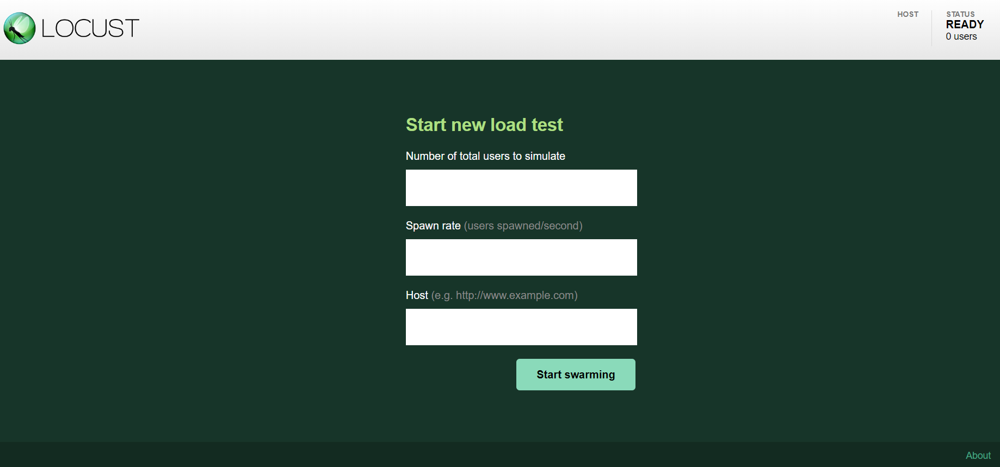

<p align="center">
  <a href="" rel="noopener">
 </a>
</p>

<h1 align="center">Instalando e Configurando o Locust pela primeira vez</h1> 
<p align="center"><i>Usaremos uma API Pública para fazer os testes de carga</i></p>

## 📑 Requisitos

- Ter Python instalado na Máquina (v3.9 ou mais recente)

## 📝 Tabela de conteúdos
- [Instalação do Locust (Passo 1)](#step1)
- [Criação do Script Python (Passo 2)](#step2)
- [Configurando API Gateway (Passo 3)](#step3)
- [Referências](#documentation)

## ⚙️ Instalação do Locust (Passo 1)<a name = "step1"></a>

1. Passo a passo da instalação: 

- Instalação com pip3 (Linux ou Windows)

    ```yaml
    $ pip3 install locust
    ```

- Instalação com o apt-get (Linux)

    ```yaml
    $ sudo apt-get install locust
    ```

- Validação da instalação

    ```yaml
    $ locust -V
    ```
    - Resultado esperado:
        ```yaml
        locust 2.29.1 from /usr/local/lib/python3.10/site-packages/locust (python 3.10.6)
        ```

## ⚙️ Criação do Script Python (Passo 2)<a name = "step2"></a>

1. Crie um script python

    ```py
    # Fazendo a importação das classes do locust
    from locust import HttpUser, TaskSet, task
    
    # Criação de uma classe, que herda atributos e comportamentos de "TaskSet"
      class UserRouteLoadTest(TaskSet):
        
        # Tarefa que será realizada (qual será o teste de carga, tipo de requisição, etc)
          @task()
          def test_list_users(self):
              self.client.get("/usuarios", name="Listar os usuários")
    
    # Classe que herda atributos e comportamentos de HttpUser
      class WebsiteUser(HttpUser):
          tasks = [
              UserRouteLoadTest
          ]
    ```

2. Executando o script de teste do Locust

    ```yaml
    $ locust -f teste-locust.py
    ```
    - O nome do arquivo pode ser qualquer um, "teste-locust.py" é apenas um exemplo

- Acessando a interface gráfica do Locust

    - No navegador acesse:
        ```
        localhost:8089
        ```

    Se tudo der certo, essa página será exibida:

    
    
    - Você pode especificar alguns parâmetros para o teste nessa interface, como:
    1. Número de usuários totais para simular (Number of total users to simulate)
    2. Número de usuários que serão gerados por segundo (Spawn rate)
    3. URL/Endpoint que será testado (Host) 

- Caso encontre algum erro ao editar, cheque a documentação de referência no final do READme.

## Referências utilizadas:<a name="documentation"></a>

- [Installation Guide - Locust](https://docs.locust.io/en/stable/installation.html)
